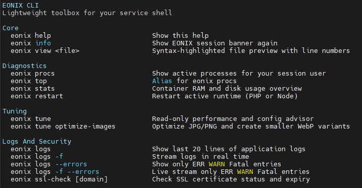

# EONIX CLI - Lightweight Service Shell Toolbox

Welcome to the official documentation for the **EONIX CLI** (`eonix`), an advanced, developer-first command-line interface engineered natively into every EONIX container instance. 

Unlike traditional shared hostings with restricted, crippled SSH environments, EONIX provides a hardened, high-performance sandbox coupled with an intuitive DevOps toolbox to diagnose, tune, and monitor your web applications instantly.

---

## 📸 Preview

---

## 🛠️ Command Reference

### Core Commands
Essential tools for session management and file inspection.

* **`eonix help`** (or **`eonix -h`**)
    * **Description:** Displays the lightweight toolbox helper menu with categorized command listings.
* **`eonix info`**
    * **Description:** Re-renders the signature fuchsia-themed EONIX welcome session banner showing system specs and environment details.
* **`eonix view <file>`**
    * **Description:** Elegant, syntax-highlighted file preview with native line numbering. Perfect for a quick look at `.env`, `wp-config.php`, or `package.json` without opening heavy text editors.

### Diagnostics
Real-time resource tracking and service state management.

* **`eonix procs`**
    * **Description:** Shows isolated, active system processes belonging strictly to your container session user.
* **`eonix top`**
    * **Description:** A high-performance, minimalist alias for `eonix procs` to track live process metrics.
* **`eonix stats`**
    * **Description:** Quick, lightweight RAM and disk storage usage overview. Never blindly hit your container quotas.
* **`eonix restart`**
    * **Description:** Instantly reloads the active runtime server (zero-downtime reload for OpenLiteSpeed LSPHP or Node.js instances).

### Tuning
Automated performance advisors and asset optimization built into the shell.

* **`eonix tune`**
    * **Description:** A completely safe, **read-only** performance and configuration advisor. Scans your application directory (WordPress, Next.js, PrestaShop and other) to detect configuration flaws, debug mode leaks, or missing caches.
* **`eonix tune optimize-images [folder]`**
    * **Description:** Scans image directories to losslessly compress JPG/PNG files and dynamically generates modern, lightweight `.webp` variants to skyrocket your Google PageSpeed scores.

### Logs And Security
Deep application insight and SSL verification.

* **`eonix logs`**
    * **Description:** Fetches the last 20 lines of your active web server application log files.
* **`eonix logs -f`**
    * **Description:** Initiates a live, real-time log stream (`tail -f`) directly in your terminal window.
* **`eonix logs --errors`**
    * **Description:** Filters log outputs to display **only** `ERR`, `WARN`, and `Fatal` level entries, eliminating system noise.
* **`eonix logs -f --errors`**
    * **Description:** Live streams only critical application errors and warnings in real-time as they happen.
* **`eonix ssl-check [domain]`**
    * **Description:** Inspects and validates the current SSL/TLS certificate status, issuer authority, and exact expiry date.

---

## 🛡️ Built-in Security & Anti-Disaster Layer

EONIX is designed to protect your production files from human errors. The environment includes a native **destructive command protection system**. If a user accidentally executes unsafe wildcards like `rm -rf` on critical core system mapping folders, EONIX halts the operation, requests verification, or safely drops the execution context.

---

*Designed by developers, for developers. Driven by hunger for engineering excellence.*
